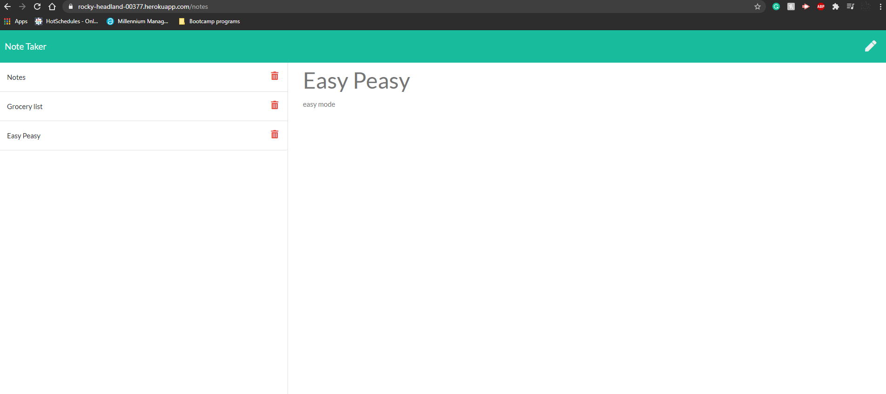

# Note-taker

## Overview
This project utilizes express to create an app that writes, saves, and deletes notes created by the user. 

## Table of Contents

1. [Installation](#installation)

2. [Usage](#usage)

3. [Contributions](#contribution)

4. [Test Instructions](#test-instructions)

5. [Screenshots](#screenshots)

6. [Licenses](#licenses)

7. [Questions](#questions)

## Installation

To install locally: git clone the repository and run "npm install" in the directory.

## Usage

For local use: enter "npm run start" in the CLI in the directory with the code to start listening on the specified port, then go to localhost:"insert port here" in the browser to view application.
For online use: go to https://rocky-headland-00377.herokuapp.com/notes to view deployed project.

Enter Notes in the Header and body and click the save icon located at the top right of the page to save notes. Click previous notes located on the left-most side to view them again.
## Contribution

none

## Test Instructions

none

## Screenshots

## License

    
## Questions? Contact Me!

My GitHub is [bo-stevenson](https://www.github.com/bo-stevenson).

My email is [bostevenson1027@gmail.com](mailto:bostevenson1027@gmail.com).
